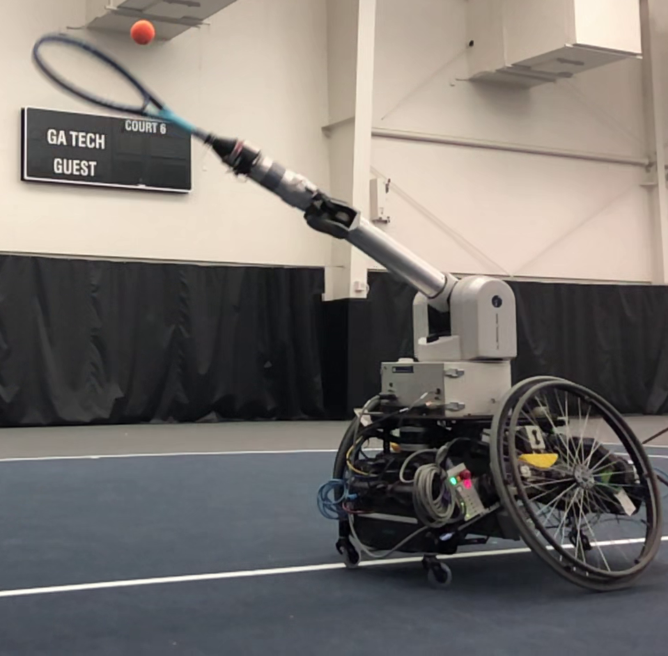
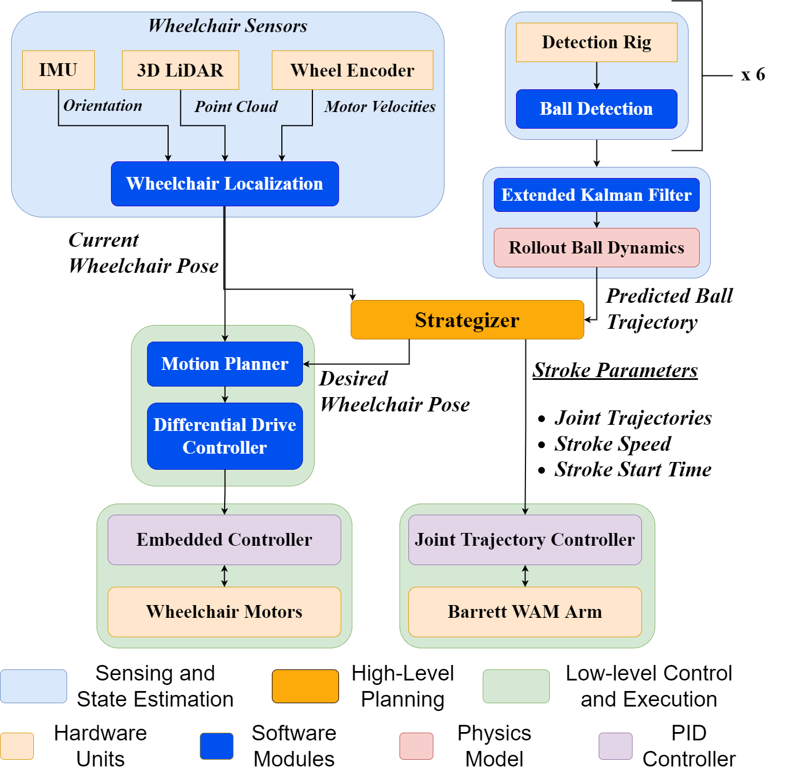

# Wheelchair-Tennis-Robot

[https://core-robotics-lab.github.io/Wheelchair-Tennis-Robot/](https://core-robotics-lab.github.io/Wheelchair-Tennis-Robot/)

The central repo for the Wheelchair Tennis Robot project.

    

## Getting Started
 - [Hardware](hardware/)
   - [Mechanical](hardware/mechanical/README.md)
   - [Electrical](hardware/electrical/README.md)
 - [Firmware](firmware/README.md)
 - [Software](software/README.md)

## Overall Design

    

