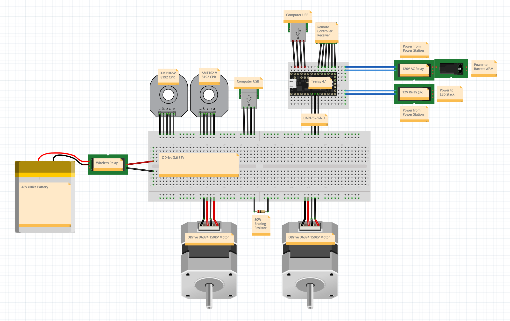

# Electrical

- [Electrical](#electrical)
  - [Parts](#parts)
  - [Wiring](#wiring)

## Parts

| Item                               | Part Link                                                                                                                                            | Comments |
| ---------------------------------- | ---------------------------------------------------------------------------------------------------------------------------------------------------- | -------- |
| GBoost Battery (1x)                | [https://www.gboost.bike/shop/batteries/system-battery-extra-performance/](https://www.gboost.bike/shop/batteries/system-battery-extra-performance/) |          |
| ODrive 3.6 56V (1x)                | [https://odriverobotics.com/shop/odrive-v36](https://odriverobotics.com/shop/odrive-v36)                                                             |          |
| D6374 150KV motor (2x)             | [https://odriverobotics.com/shop/odrive-custom-motor-d6374-150kv](https://odriverobotics.com/shop/odrive-custom-motor-d6374-150kv)                   |          |
| CUI AMT102-V 8192 CPR encoder (2x) | [https://odriverobotics.com/shop/cui-amt-102](https://odriverobotics.com/shop/cui-amt-102)                                                           |          |
| Teensy 4.1 (1x)                    | [https://www.pjrc.com/store/teensy41.html](https://www.pjrc.com/store/teensy41.html)                                                                 |          |
| Wireless Relay (1x)                | [https://www.amazon.com/dp/B098RSF6X3/](https://www.amazon.com/dp/B098RSF6X3/)                                                                       |          |
| 4-Channel Relay Board (1x)         | [https://www.amazon.com/dp/B07BDJJTLZ/](https://www.amazon.com/dp/B07BDJJTLZ/)                                                                       |          |
| Light Indicator Tower (1x)         | [https://www.amazon.com/dp/B01NBJ0K0W/](https://www.amazon.com/dp/B01NBJ0K0W/)                                                                       |          |
| Anker 535 PowerHouse (1x)          | [https://www.anker.com/products/a1751?variant=41686355771542](https://www.anker.com/products/a1751?variant=41686355771542)                           |          |

## Wiring

To get started with the electrical system, a high level wiring diagram is shown below that needs to be assembled. 

