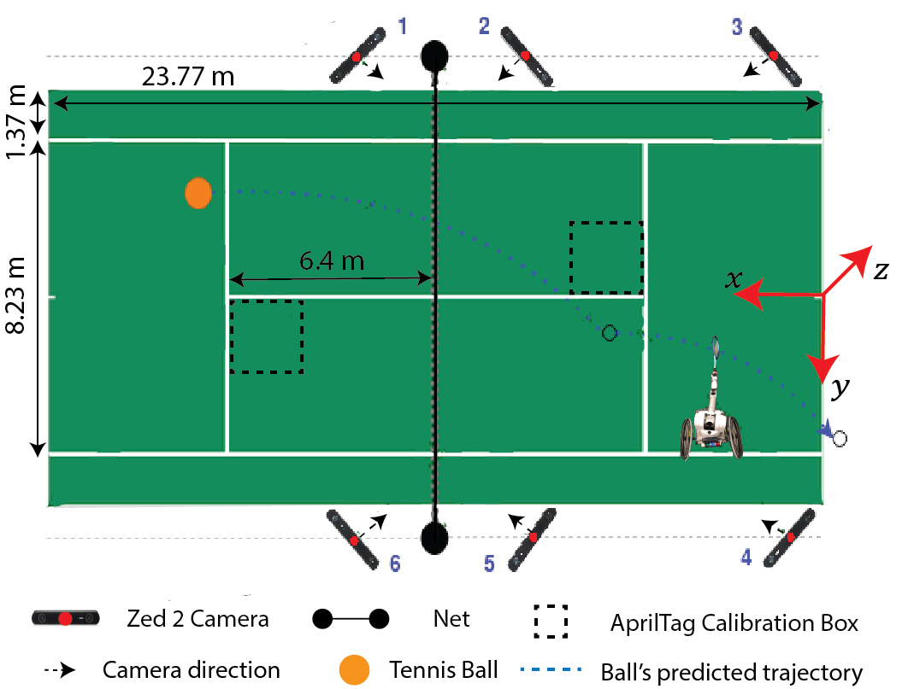
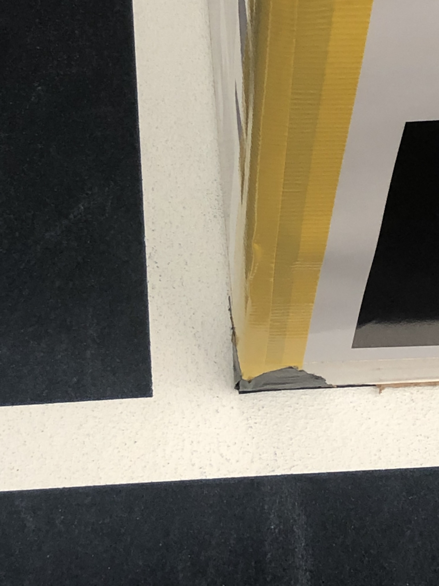

# ball_calibration Package

Used to find cameras position in world and command jetsons

- [ball\_calibration Package](#ball_calibration-package)
  - [Calibration](#calibration)
    - [Tennis Courts Calibration:](#tennis-courts-calibration)
    - [How to calibrate standalone zed (without jetsons and box):](#how-to-calibrate-standalone-zed-without-jetsons-and-box)
    - [Helpful](#helpful)
    - [Troubleshooting](#troubleshooting)
    - [Comand Cheetsheet](#comand-cheetsheet)
      - [At Courts Commands](#at-courts-commands)
      - [Update Jetsons Git Repo Commands](#update-jetsons-git-repo-commands)

## Calibration
### Tennis Courts Calibration:
* Set up all jetson stands on the court (ex. Connect jetson batteries, place stands properly, power router). Here is how the stands and box should be setup:
    

        
    

* Set calibration box so its **black** corner aligns with service-line's corner
    

        
    

* Run `nmap -sP 192.168.1.* | grep "192.168.1.10"` to detect available Jetsons (Make sure computer on `core-robotics-net-2`)
* Run Apriltag detection on all cameras:
    * `roslaunch ball_calibration jetson_apriltag_multi.launch`
    * **Note:** Make sure to comment/uncomment broken camera IDs in launch file if some cameras aren't working
    * Check `rqt_gui` that popped up to make sure that tags are getting detected (Press the refresh button if stream not appearing)
* Run calibration script:
  * If you are at courts and set up the cameras properly, you can just do `roslaunch ball_calibration jetson_record_calib.launch type:=our_side` and then with `type:=opp_side` when you move box to opposite side of wheelchair. 
    * Check printed camera statistics to make sure everything is okay
      * All cameras have 5+ samples
  * If at lab, edit `jetson_record_calib.launch` for `type=other` so cameras map to correct bundle 
      * Use colored tape on box for mapping if you want: Bundle 1 (Yellow), Bundle 2 (Green), Bundle 3 (Blue), Bundle 4 (Purple)
    * Then run `roslaunch ball_calibration jetson_record_calib.launch`

    
* Run ball detection on Jetson:
    * `roslaunch ball_calibration jetson_ball_detection_multi.launch`
    * Optional: Tune gain so the images are well-illuminated (Look at _Helpful_ section)
    * You should close the debug image GUI if you want 30 Hz ball pose estimate since producing debug image is a little expensive
* Run `roslaunch ball_calibration box_cameras.launch` or a launch file that includes it like `roslaunch ball_calibration demo_courts.launch`

### How to calibrate standalone zed (without jetsons and box):
* `roslaunch ball_calibration standalone_apriltag.launch` 
* `rosrun tf tf_echo <Parent TF> /zed_camera_center`
    * ex. `<Parent TF>` is frame like `/bundle` or `/tag_5`
* Record pose in `standalone_cameras.launch` for specific camera
* Run ball detection code from `ball_detection` (requires ZED SDK)
    * `roslaunch ball_detection ball_detection.launch`
* Run `roslaunch ball_calibration standalone_cameras.launch`
    * Will run EKF as well

### Helpful
* Run auto-gain calibration script (75 gain is usually good enough):
    * `roslaunch ball_calibration jetson_autogain_multi.launch`
    * Edit `config/jetson_ball_detection.yaml` for respective gain

### Troubleshooting
* Error: **no such option: --sigint-timeout** or **If <filename> is a single dash ('-'),**
    * `sudo gedit /opt/ros/noetic/lib/python3/dist-packages/roslaunch/remoteprocess.py `
    * Edit line 141 to `args = [machine.env_loader, 'roslaunch', '-c', name, '-u', server_uri, '--run_id', run_id]`
* Error: **RLException: Exception while registering with roslaunch parent**
    * Make sure you setup `ROS_MASTER_URI`
* Error: Jetson connecting to other network
  * `sudo nmcli c delete <WIFI Connection>`
  * `sudo nmcli d wifi connect 'core-robotics-net-2_5G' password ogmcglab`

### Comand Cheetsheet
#### At Courts Commands
- `   nmap -sP 192.168.1.* | grep "192.168.1.10"   `
- `   roslaunch ball_calibration jetson_apriltag_multi.launch   `
- `   roslaunch ball_calibration jetson_record_calib.launch type:=court_our   `
- `   roslaunch ball_calibration jetson_record_calib.launch type:=court_opp   `
- `   roslaunch ball_calibration jetson_ball_detection_multi.launch   `
- `   roslaunch wtr_plan demo_court.launch   `

#### Update Jetsons Git Repo Commands
- `  sshpass -p 1111 ssh jetson-nano-1@192.168.1.101  `
- `  cd ~/catkin_ws/src/Wheelchair-Tennis-Robot/ && git pull && cd ~/catkin_ws && catkin_make  `

